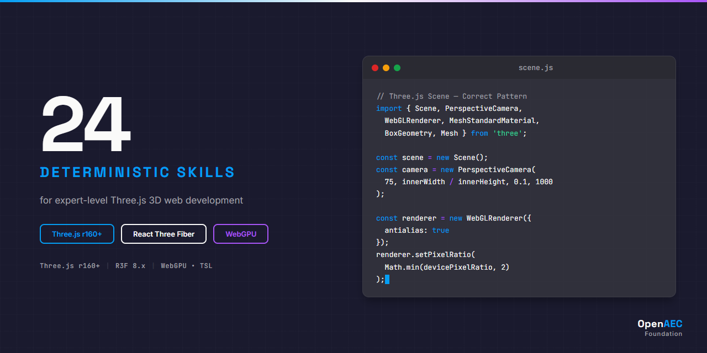

<p align="center">
  
</p>

# Three.js Claude Skill Package

> 24 deterministic skills for Three.js 3D web development with Claude Code.

[](https://opensource.org/licenses/MIT)
[](https://threejs.org/)
[]()

A comprehensive skill package that gives Claude deep knowledge of Three.js r160+, React Three Fiber, Drei, WebGPU, physics engines, and more. Every skill uses deterministic ALWAYS/NEVER language for consistent, reliable code generation.

## Installation

Add this repository as a skill source in your Claude Code project:

```bash
# Clone the repository
git clone https://github.com/OpenAEC-Foundation/Three.js-Claude-Skill-Package.git

# Or add as a git submodule
git submodule add https://github.com/OpenAEC-Foundation/Three.js-Claude-Skill-Package.git .claude/skills/threejs
```

Then reference the skills directory in your Claude Code configuration.

## Skills Overview

| Category | Count | Skills |
|----------|-------|--------|
| **Core** | 4 | Scene Graph, Renderer, Math, Raycaster |
| **Syntax** | 5 | Geometries, Materials, Shaders, Loaders, Controls |
| **Implementation** | 10 | Lighting, Shadows, Animation, Post-Processing, Physics, R3F, Drei, WebGPU, IFC, Audio, XR |
| **Errors** | 2 | Performance, Rendering |
| **Agents** | 2 | Scene Builder, Model Optimizer |

### Core Skills — Foundation

- **threejs-core-scene-graph** — Object3D hierarchy, traversal, layers, fog, coordinate conversion
- **threejs-core-renderer** — WebGLRenderer, tone mapping, color management, render targets
- **threejs-core-math** — Vector3, Matrix4, Quaternion, Euler, Color, MathUtils
- **threejs-core-raycaster** — Mouse picking, hover detection, InstancedMesh picking

### Syntax Skills — Building Blocks

- **threejs-syntax-geometries** — BufferGeometry, 21 built-in geometries, InstancedMesh
- **threejs-syntax-materials** — 15+ material types, PBR, textures, color space rules
- **threejs-syntax-shaders** — ShaderMaterial, GLSL, uniforms, ShaderChunk, onBeforeCompile
- **threejs-syntax-loaders** — GLTFLoader, DRACOLoader, KTX2Loader, TextureLoader
- **threejs-syntax-controls** — OrbitControls, MapControls, FlyControls, TransformControls

### Implementation Skills — Feature Recipes

- **threejs-impl-lighting** — 7 light types, IBL, PMREMGenerator, HDR environment maps
- **threejs-impl-shadows** — Shadow maps, bias tuning, artifact diagnosis
- **threejs-impl-animation** — AnimationMixer, crossfade, skeletal animation from GLTF
- **threejs-impl-post-processing** — EffectComposer, pmndrs/postprocessing, bloom, SSAO
- **threejs-impl-physics** — cannon-es and Rapier integration with sync patterns
- **threejs-impl-react-three-fiber** — R3F Canvas, hooks, JSX mapping, event system
- **threejs-impl-drei** — 150+ Drei helper components
- **threejs-impl-webgpu** — WebGPURenderer, TSL, node materials, compute shaders
- **threejs-impl-ifc-viewer** — IFC/BIM loading with web-ifc and @thatopen/components
- **threejs-impl-audio** — 3D spatial audio, AudioListener, PositionalAudio
- **threejs-impl-xr** — WebXR VR/AR, controllers, hand tracking, hit testing

### Error Skills — Debugging

- **threejs-errors-performance** — Memory leaks, dispose patterns, draw call optimization
- **threejs-errors-rendering** — Black screen, wrong colors, z-fighting, shadow artifacts

### Agent Skills — Orchestration

- **threejs-agents-scene-builder** — Decision trees for complete scene composition
- **threejs-agents-model-optimizer** — GLTF optimization pipeline (Draco, KTX2, LOD)

## Skill Quality

Every skill in this package meets strict quality requirements:

- **< 500 lines** per SKILL.md (average: 338 lines)
- **Deterministic language** — ALWAYS/NEVER, zero hedging words
- **English only** — Claude reads English, responds in any language
- **Complete references** — methods.md, examples.md, anti-patterns.md per skill
- **ES module imports** — Modern `import { X } from 'three'` syntax
- **Version-explicit** — Three.js r160+, React Three Fiber 8.x
- **Self-contained** — Each skill works independently

## Technology Coverage

| Technology | Version | Skills |
|------------|---------|--------|
| Three.js | r160+ | All 24 skills |
| React Three Fiber | 8.x+ | impl-react-three-fiber, impl-drei |
| Drei | Latest | impl-drei |
| WebGPU Renderer | Experimental | impl-webgpu |
| cannon-es | 0.20+ | impl-physics |
| Rapier | 0.12+ | impl-physics |
| @thatopen/components | v3.x | impl-ifc-viewer |
| WebXR | Latest | impl-xr |

## Project Structure

```
Three.js-Claude-Skill-Package/
├── skills/source/
│   ├── threejs-core/          (4 skills)
│   ├── threejs-syntax/        (5 skills)
│   ├── threejs-impl/          (10 skills)
│   ├── threejs-errors/        (2 skills)
│   └── threejs-agents/        (2 skills)
├── docs/
│   ├── masterplan/            (raw + definitive masterplan)
│   ├── research/              (7 research documents, 27,627 words)
│   └── validation/            (validation report)
├── CLAUDE.md                  (project configuration)
├── INDEX.md                   (complete skill catalog)
├── REQUIREMENTS.md            (quality guarantees)
├── ROADMAP.md                 (project status)
└── README.md                  (this file)
```

## Methodology

This package was built using the proven 7-phase research-first methodology:

1. **Raw Masterplan** — Technology landscape mapping
2. **Deep Research** — 27,627 words of vooronderzoek across 7 documents
3. **Masterplan Refinement** — 19 → 24 skills with atomic skill principle
4. **Skill Creation** — 8 parallel batches of 3 skills each
5. **Validation** — 24/24 skills PASS all quality gates
6. **Publication** — README, INDEX, CHANGELOG, GitHub release

## Related Packages

- [ERPNext Skill Package](https://github.com/OpenAEC-Foundation/ERPNext_Anthropic_Claude_Development_Skill_Package) (28 skills)
- [Blender-Bonsai Skill Package](https://github.com/OpenAEC-Foundation/Blender-Bonsai-ifcOpenshell-Sverchok-Claude-Skill-Package) (73 skills)
- [Tauri 2 Skill Package](https://github.com/OpenAEC-Foundation/Tauri-2-Claude-Skill-Package) (27 skills)

---

## Companion Skills: Cross-Technology Integration

> **[Cross-Tech AEC Integration Skills](https://github.com/OpenAEC-Foundation/Cross-Tech-AEC-Claude-Skill-Package)** — 15 skills for technology boundaries

| Skill | Boundary | What it adds |
|-------|----------|-------------|
| `crosstech-impl-ifc-to-threejs` | IFC ↔ Three.js | Loading IFC into Three.js, @thatopen/components, Fragments format |
| `crosstech-impl-bim-web-viewer` | BIM ↔ Web browser | End-to-end BIM viewer with Three.js |
| `crosstech-core-coordinate-systems` | BIM ↔ GIS | Y-up (Three.js) vs Z-up (IFC) axis handling |

## License

MIT — see [LICENSE](LICENSE) for details.

## Author

[OpenAEC Foundation](https://github.com/OpenAEC-Foundation)
